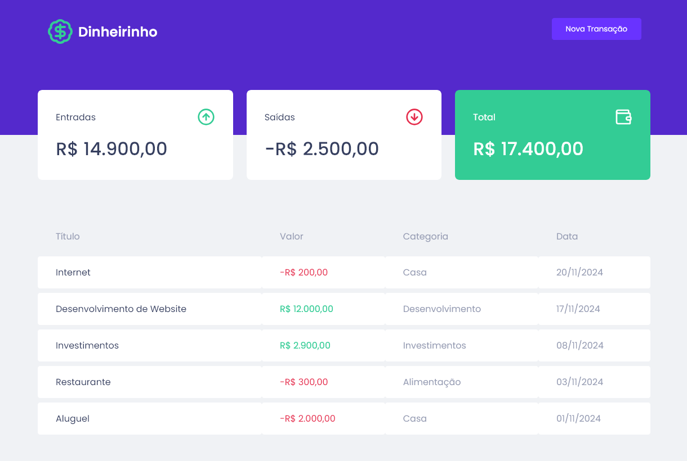
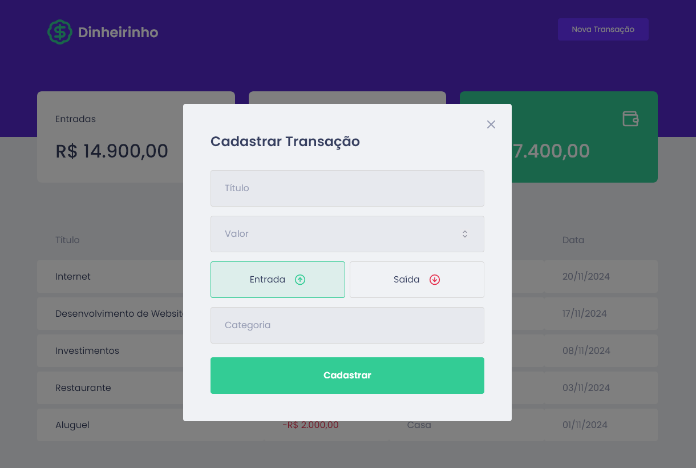

# Dinheirinho 💸

**Dinheirinho** é uma aplicação de controle financeiro pessoal que permite registrar e visualizar entradas e saídas de dinheiro, mostrando o saldo total e detalhando cada transação com categoria e data.

## Funcionalidades

- **Dashboard Resumido**: Visualize o total de entradas, saídas e saldo atual.
- **Cadastro de Transações**: Adicione novas transações de entrada ou saída com título, valor, e categoria.
- **Organização Visual**: As transações são listadas de maneira organizada para fácil visualização e análise.

## Tecnologias Utilizadas

- **Frontend**: ReactJS com Styled Components para estilização.
- **"Backend"**: MirageJS para gerenciar as rotas de transação.
- **Banco de Dados**: MirageJS.
- **Estilização**: SCSS customizado e paleta de cores moderna para uma interface intuitiva e agradável.

## Como Usar

1. **Adicionar Transações**: Clique em "Nova Transação" e preencha os dados da transação para adicionar ao painel principal.
2. **Acompanhar o Saldo**: Visualize o saldo atualizado automaticamente com cada transação.

Este projeto foi desenvolvido como parte do meu portfólio para demonstrar habilidades em desenvolvimento web frontend e backend,
criação de UI intuitiva, e integração de dados.

## Licença

Projeto criado para fins de aprendizado e portfólio. Sinta-se livre para explorar e adaptar o código!
